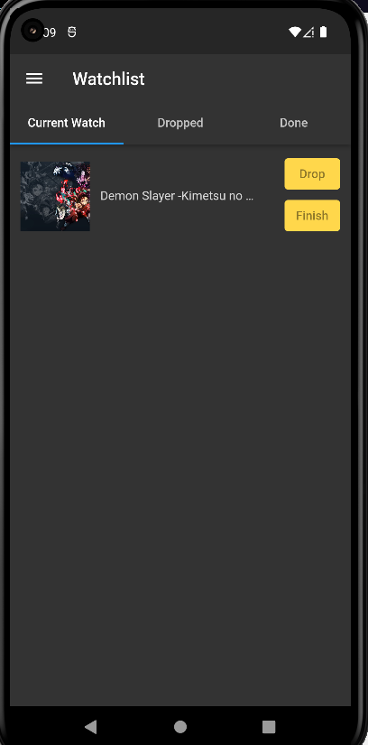
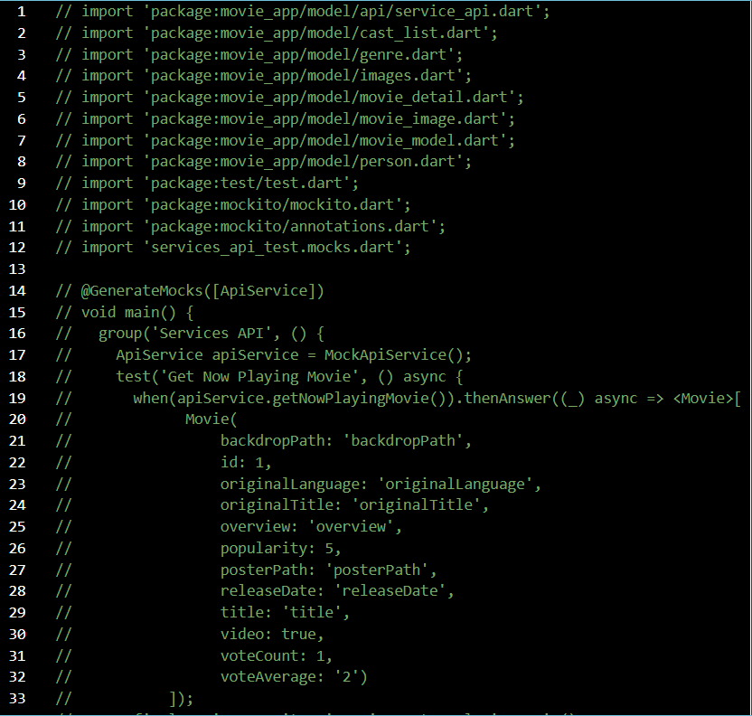

# Cineminfo: Movie-App-Recomendation

Untuk menggunakan API_KEY TMDB milikmu bisa di masukkan di /model/api/services_api.dart lalu ganti pada bagian apiKey = "your_api_key"

Dibagian Login/SignIn jika belum punya akun bisa ke bagian SignUp

Jika sudah maka kamu akan dipindahkan ke Movie Screen seperti ini:

Disitu ada beberapa fitur yang digunakan seperti mengklik movie yang ada jika diklik maka akan menampilkan detail dari movie tersebut, seperti ini:

Dibagian detail movie kamu bisa mengklik tombol play untuk memutar trailer dari movie tersebut

Selain itu ada fitur search movie dibagian kanan atas movie screen jika diklik dan mengisi textfieldnya akan muncul seperti berikut:

Lalu ada bagian drawer dipojok kiri movie screen jika diklik akan menampilkan UI seperti berikut:

Di bagian drawer akan memunculkan nama dan email yang telah kamu daftarkan dan ada beberapa fitur seperti profile, movie, watchlist dan log out

Di profile screen akan memunculkan UI seperti berikut:

Di sana ada beberapa fitur seperti edit profile dan change password

Di edit profile akan menampilkan dua buah textfield untuk mengganti nama dan email

Di change password akan menampilkan juga dua buah texxtfield untuk mengganti password dan konfirmasi password

Lalu untuk dibagian watchlist screen akan menampilkan tiga buah tab yaitu watchlist, droplist dan finishlist

Watchlist untuk menampilkan movie yang sedang atau mau kamu tonton
Droplist untuk menampilkan movie yang kamu tidak selesai ditonton dan menurutmu itu movie yang kurang bagus buatmu
Finishlist untuk menampilkan movie yang sudah selesai kamu tonton

Dan untuk logout maka kamu akan dikembalikan ke login/sigIn Screen
satu fitur terakhir adalah reset password, reset password ini digunakan untuk mereset password menggunakan email.
Lalu nani akan dikirimkan reset passwordnya ke email yang kamu masukkan

Untuk melakukan test unit dan widget bisa terlebih dahulu ke bagian service_api.dart lalu hapus semua static yang ada pada file tersebut lalu save.
Setelah itu dibagian unit_test Uncomment seluruh coding terlebih dahulu lalu save.

Pada terminal lakukan flutter test untuk ngetest unit dan widget yang sudah di coding.

